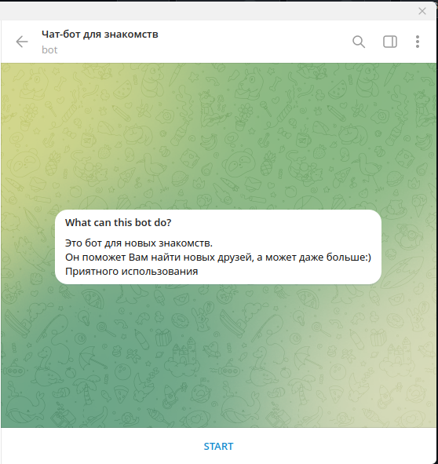

# Чат-бот для знакомств

Это бот в мессенджере *Telegram*, 
преднызначеный для удобного знакомства людей, в частности школьников. 
Он призван облегчить процесс поиска собеседника или друга в сети Интернет

## Используемые технологии

* Python 3.10.10
* aiogram 2.x (фреймворк для telegram ботов)
* PostgreSQL (СУБД)
* SQLAlchemy (ORM)
* Vim
* Git (распределенная система контроля версий)

## Запуск
*Все действия проверялись для **Arch Linux**, но они также должны работать и на других дистрибутивах*
1. Проверьте установленую версию python(`python -V`), при необходимости установите 3.10
2. Если у вас не установлен Git, то установите(`pacman -S git` для Arch, воспользуйтесь другим пакетным менеджером для других дистрибутивов)
3. Перейдите в папку, в которую хотите установить проект (например `cd projects/python_projects`)
4. Клонируйте этот репозиторий с помощью git clone: `git clone https://github.com/OlejaPythonist/acquaintance_bot`
5. Перейдите в него(`cd acquaintance_bot`)
6. Создайте виртуальное окружение командой `python -m venv venv`
7. Активируйте его: `source venv/bin/activate` 
8. Установите необходимые библиотеки с помощью pip: `pip install -r requirements.txt`
9. Создайте переменную окружения с вашим токеном бота: `export BOT_TOKEN="ваш токен полученый у BotFather"`.
 <a href="https://t.me/BotFather">BotFather</a>

10. Таким же способом(`export name=value`) установите имя пользоватея(USER), пароль(PASSWD), хостинг(HOST) и базу данных(DATABASE_NAME)

P.S. Предполагается что вы уже развернули базу данных PostgreSQL и создали для нее пользователя

12. `cd src`
13. Запустите бота: `python -m tgbot`

P.S. 
Некоторые команды может понадобиться запускать от имени root, для этого воспользуйтесь утилитой sudo

P.P.S. 
При запуске 2 скриптов с одним токеном, оба перестанут работать. Именно это и послужило причиной хранить 
токен в переменной окружения

## Функционал
* Создание и изменение собственной анкеты
* Просмотр своей анкеты
* Просмтор анкет других анкет, подходящих по параметрам
* Вы можете оценивать чужие анкеты, либо, при необходимости, отправить жалобу.
* При заполнении профиля Вам будет доступна клавиатура с шаблонами ответов.
* Это сделано для большего удобства.
* Предусмотрена защита от спама, за основу был взят пример из документации aiogram.
